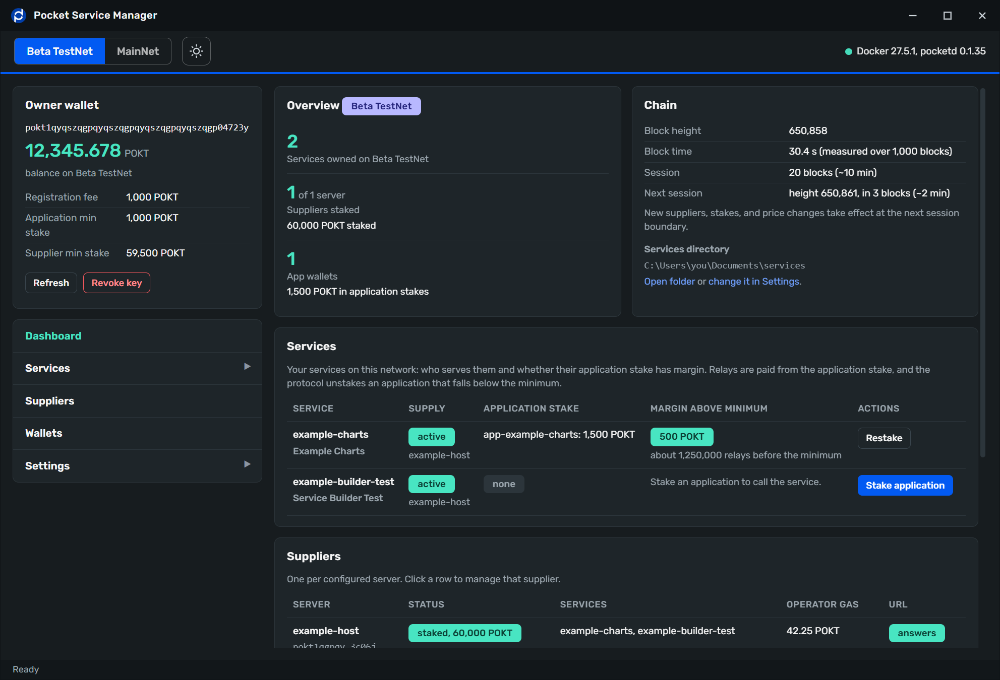

# Pocket Service Manager for Windows



A desktop app that takes an HTTP API from a folder on your PC to a live, paid service on [Pocket Network](https://pocket.network). It writes the service card, registers the service on chain, turns a server of yours into a supplier that serves it, stakes the supplier and an application wallet, and tests real relays through the protocol. Every step is a button. You never type a `pocketd` command.

It works with Claude Code: one click in Settings gives Claude the read-only Pocket tools, and one more lets Claude drive this app's own operations through a local bridge, with every spend still confirmed in the app window.

**A note from Jinx:**

One of the most common requests we get is an easier way for community members to interact with the protocol from a Windows desktop without needing to understand CLI and advanced server management. This app, paired with Claude Code, makes the entire process easy and painless. 

But Windows, unfortunately, does not. Their current process to get a code signing certificate involves jumping through a lot of hoops, asking for things we don't have (like a publicly listed phone number), and paying for services we don't need. Because of this, we're opting to release this app through Scoop, which allows you to download it from a script instead of from a browser. That bypasses the need for a signing certificate. Setting up Scoop the first time on your machine is three cut and paste commands in Powershell, and downloading the app is two more. Five lines in CLI, and you never have to use it again.

We've worked hard to make this setup easy to use so that you can deploy your own data services on the network without being a sysadmin, but I'm sure you'll run into problems here and there. If you do, use the Issues tab up top to open a request, and we'll get to it as soon as we can. 

Thanks. 

## Install

**Requirements:** Windows 10 or 11, 64-bit, and [Docker Desktop](https://www.docker.com/products/docker-desktop/) installed and running. The Pocket tools run in containers; the app downloads them once.

**Install with Scoop.** This is the only supported way to install. The app is not code-signed yet, and current Windows 11 installs refuse to run an unsigned program downloaded through a browser; Scoop fetches and installs it with its own client, which Windows does not block. Open a normal PowerShell window, not one run as administrator, and run these one at a time:

```powershell
Set-ExecutionPolicy -ExecutionPolicy RemoteSigned -Scope CurrentUser
```

```powershell
irm get.scoop.sh | iex
```

```powershell
scoop install git
```

```powershell
scoop bucket add pocket https://github.com/pokt-network/PSM4Win
```

```powershell
scoop install pocket-service-manager
```

The first line lets your own account run installers; Windows ships with that switched off. The third installs Git, which Scoop needs to add a bucket. Both are skipped on a machine that already has them.

Later versions:

```powershell
scoop update pocket-service-manager
```

The [releases page](https://github.com/pokt-network/PSM4Win/releases) holds the files Scoop installs and their `SHA256SUMS`. Downloading them by hand is not a supported way to install: Windows blocks the unsigned files, and the in-app updater expects a Scoop install.

## First run

1. Import the wallet that will own your services from the **Owner wallet** card. It goes into an encrypted keyring on this PC.
2. Open **Settings, Help** and read the five short chapters. They explain how a service works, what to have ready, and the steps in order. With your service app and server ready, the whole cycle takes about twenty minutes.
3. Do everything on **Beta TestNet** first. Test POKT is free from the faucet linked under Help, Resources.

## Claude Code

Under **Settings, Claude Integration**:

- **Add to Claude Code** gives Claude the read-only Pocket tools (catalog, live parameters, cards, supplier state). Choose "Always allow" when Claude asks about them; they never sign or spend.
- **Local action bridge**: turn it on, then Add to Claude Code. Claude can then read the app's state, preview any transaction, deploy, and start transactions. Every spend or signature opens a confirmation in the app window and waits for you; on MainNet you type the usual word. Keys and recovery phrases are never available over the bridge.

Both work with Claude Code in the Claude desktop app's Code tab and in a terminal.

## What the app never does

- It never shows a private key except when you ask for it with a typed confirmation, and never sends one anywhere.
- It never hardcodes a chain value. Fees, minimum stakes, session length, and unbonding periods are read from the network at the moment of use.
- It never runs a `pocketd` command you did not start from a button, and every transaction shows its exact command before you confirm it.

## Development

```powershell
npm install
```

```powershell
npm run dev
```

`npm test` runs the unit tests, `npm run typecheck` and `npm run lint` the checks, `npm run selftest:beta` the headless signer check against Beta TestNet (needs Docker Desktop), and `npm run build:win` produces the installer and portable zip under `release/`.

The specification lives in `docs/`: `ARCHITECTURE.md` (process model, signer port, the local bridge), `SIGNER-CONTRACT.md` (every operation), `SCREENS.md` (every screen), `MIGRATION.md` (the importer), and `PACKAGING.md` (installer, CI, Scoop). `CLAUDE.md` is the working brief for contributors and for Claude Code sessions in this repository.

The macOS app is a separate project; this repository is Windows only.

## Licence

MIT. See `LICENSE`.
